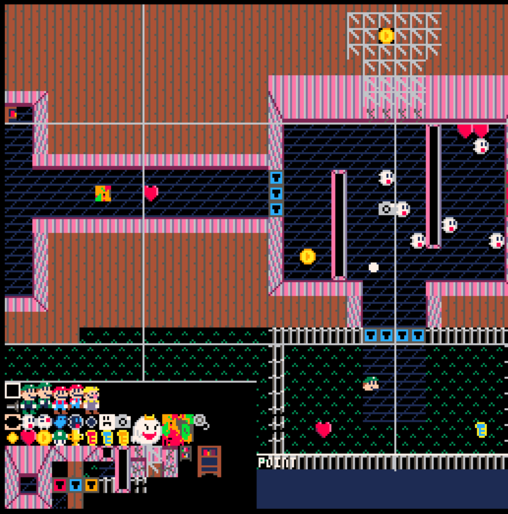

# Big Mapper
This is a utility for pico8, designed for editing map data. It will eventually be expanded upon, allowing you to edit and save to the pico8 extended memory. Its current major feature is allowing you to edit maps at 256x256 pixels, giving you a lot of breathing room.



## Setup
This cannot be run standalone - it must be run from the pico8 desktop client.

1. Run this file from commandline, with the following arguments:
```
pico8 -displays_x 2 -displays_y 2 mapper.p8
```
2. Code editing only takes place in the upper-left quadrant, which is why i edit the code externally in mapper.lua.
3. Usage instructions:
```
Pan map around: ESDF
Select a different sprite to place: Arrow Keys
Switch between paint (point) and fill modes: B
Save current map to cart ROM: 5
Export current map to another cart (you will need to edit line 187): 4
Paint or fill: Left mouse click
Dropper: RIght mouse Click
Undo: Z -- may be buggy!
```

## Running in multi-display
If you are mostly interested in multi-display, this is my current understanding of it:
1. You must run pico8 client from commandline, with the following args:
```
pico8 -displays_x X -displays_y Y -- X and Y are how wide and tall the displays will be, integers
```
2. Within your cart, you must enable multidisplay with a poke:
```
poke(0x5f36,1) 
```
3. You now have access to four displays! you must switch between them manually, and draw to them separately. This is a major CPU consumer!
```
function _draw()
    for i=0,3,1 do
        _map_display(i)
        clr(i)
        circ(64,64,10,i+2)
    end
end
```

Check out my mapping cart for tips on drawing across all displays seemlessly!